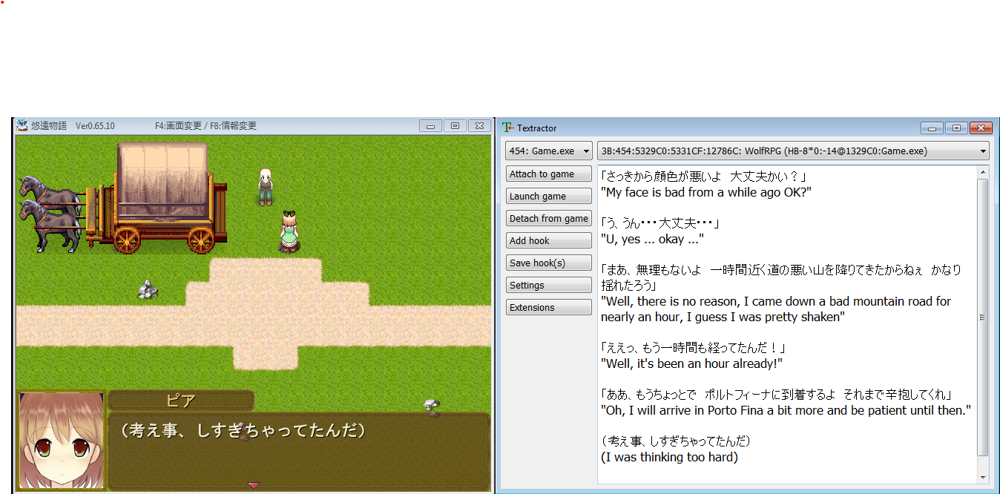

# Textractor

[English](README.md) ● [Español](README_ES.md) ● [简体中文](README_SC.md) ● [Русский](README_RU.md) ● [한국어](README_KR.md) ● [ภาษาไทย](README_TH.md) ● [Italiano](README_IT.md) ● [日本語](README_JP.md) ● [Bahasa](README_ID.md) ● [Português](README_PT.md)

**Textractor** (a.k.a. NextHooker) это проект x86/x64 Windows/Wine программы для захвата текста из видеоигр, основанный на [ITHVNR](http://www.hongfire.com/forum/showthread.php/438331-ITHVNR-ITH-with-the-VNR-engine). 
Смотреть [обучающее видео](https://tinyurl.com/textractor-tutorial) для быстрого ознакомления.

## Загрузка

Выпуски Textractor могут быть найдены [здесь](https://github.com/Artikash/Textractor/releases). 
Последний выпуск ITHVNR может быть найден [здесь](https://drive.google.com/open?id=13aHF4uIXWn-3YML_k2YCDWhtGgn5-tnO). 
Установите библиотеки Visual C redist(vcredist.x86.exe), если получаете ошибку при запуске Textractor.

## Возможности

- Высокая расширяемость
- Автозахват текста из множества игровых движков (включая некоторые, неподдерживаемые в VNR!)
- Захват текста с использованием /H "hook" кодов (поддерживается большинство AGTH кодов)
- Прямое извлечение текста с использованием /R "read" кодов

## Поддержка

Сообщайте о любых ошибках, играх, с которыми у Textractor проблемы, запросах о новых функциях или другие предложения. 
Если у вас возникают проблемы с захватом текста из какой либо игры, скиньте на электронную почту ссылку на её загрузку или киньте её подарком в [Steam](https://steamcommunity.com/profiles/76561198097566313/) , для тестирования.

## Расширения

Смотрите [Проект примера расширения](https://github.com/Artikash/ExampleExtension), чтобы узнать, как создать расширение. 
Также для примера того, что делают расширения, смотрите папку extensions. 

## Вклад

Любой вклад приветствуется! Пишите мне(автору)(нет, я не занят!) на akashmozumdar@gmail.com, если у вас есть любые вопросы о кодовой базе. 
Используйте стандартные действия для создания pull request (fork, branch, commit changes, создайте PR из своей ветки branch на мой master). 
Вклад в перевод совсем не сложен: просто переведите строки в text.cpp, также, как и этот README.

## Компиляция

Перед компиляцией *Textractor*, установите Visual Studio с поддержкой CMake, а также Qt версии 5.13 
Тогда вы сможете просто открыть и построить проект в Visual Studio. Запустите Textractor.exe.

## Архитектура проекта

Хост (смотрите папку GUI/host) внедряет texthook.dll (созданной из папки texthook) в целевой процесс и подключается к нему через два файла-канала (pipe). 
Хост пишет в hostPipe, texthook пишет в hookPipe. 
texthook ждет присоединения канала, тогда внедряет некоторые инструкции в любые выводящие текст функции (такие как TextOut, GetGlyphOutline), что вызывает пересылку поступающего в них текста через канал. 
Дополнительная информация о хуках размещена через файл просмотра (a.k.a. section object), который сопоставлен с ссылкой на класс TextHook. 
Текст, который хост получает через канал, затем немного обрабатывается перед отправкой обратно в графический интерфейс (GUI). 
Наконец, GUI отправляет текст расширениям, перед его отображением.

## [Разработчики](CREDITS.md)
